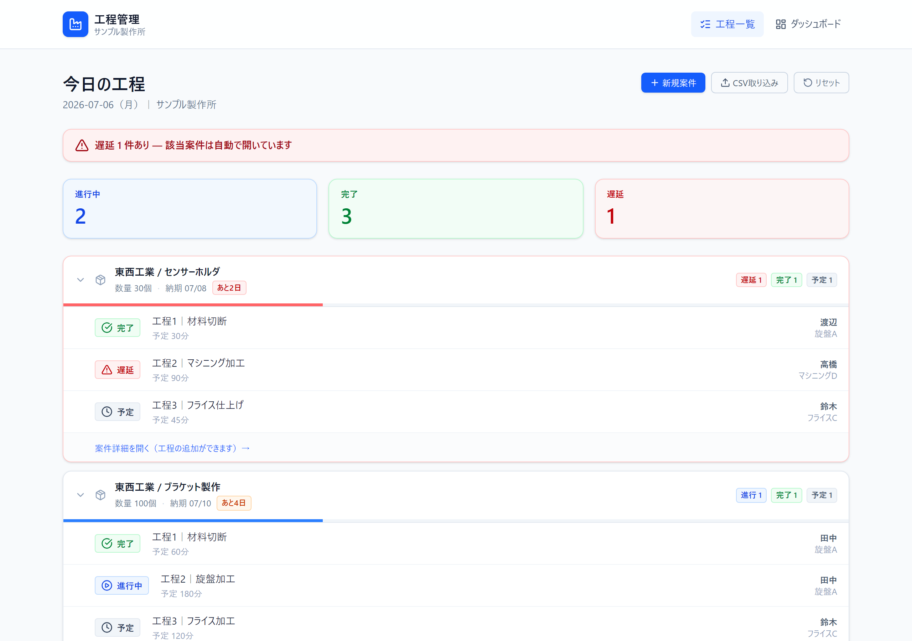
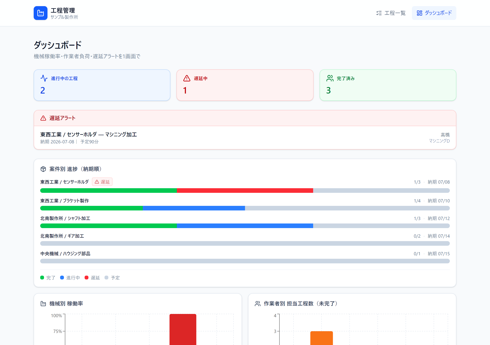
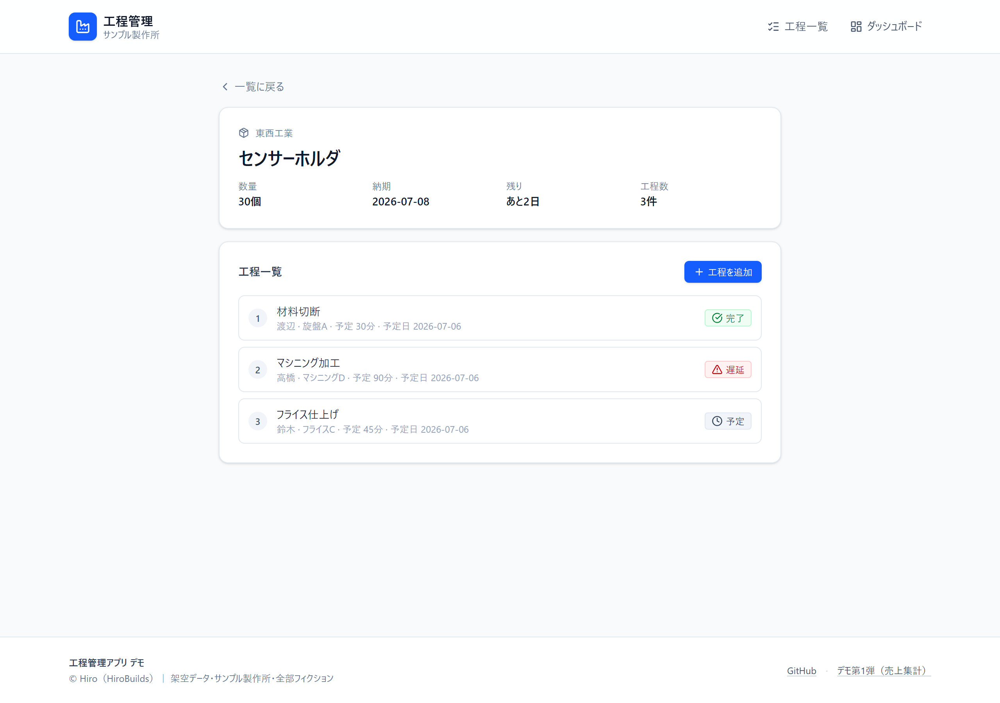
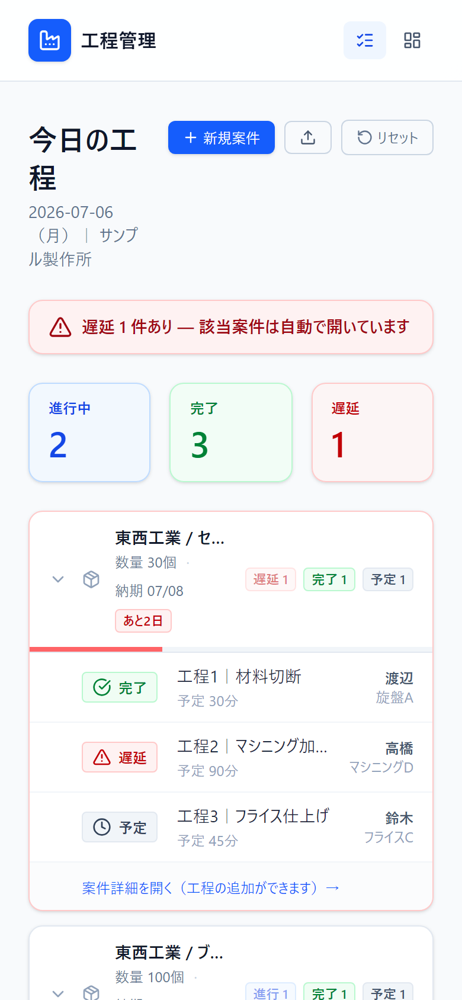

# 工程管理アプリ｜町工場デモ

町工場のホワイトボード・Excel工程表を置き換える、シンプルな工程管理アプリのデモです。
「誰がどの機械で今何をやってるか」「遅延はどこか」「明日の予定はどうか」を1画面で見えるようにします。

**公開URL**: https://process-manager-demo.vercel.app

## スクリーンショット


_案件別グループ・納期順ソート・遅延自動展開・進捗率バー・残り日数バッジ_


_KPI・遅延アラート・案件別スタック進捗・機械稼働率（100%は赤＝属人化発覚）・作業者負荷_


_案件情報＋工程一覧＋インライン工程追加フォーム_


_ナビはアイコンのみ・案件ヘッダーは自然に折り返し・現場のスマホ運用を想定_

## これは何

副業ワーカーの Hiro（元・町工場勤務・工作機械プログラミング経験）が制作した **業務ツール実物デモ** です。応募や提案の際に「こういうものを作れます」を示すための実弾で、本番運用の完成品ではありません。

サンプルデータは全部フィクション（「サンプル製作所」という架空の町工場・従業員15人・作業者/機械/客先/案件すべて架空）です。

## このデモのスコープ（先に明示）

デモの目的は「触れる証拠」＝画面設計・現場理解・業務ロジックを実物で示すことです。以下は**意図的に外しています**：

- **バックエンドなし**：状態は `sessionStorage` に保存し、タブを閉じると初期状態にリセット（デモ衛生のため）
- **認証・権限なし**：本番では事務所ユーザー／現場作業者などのロール分けを別途実装想定
- **複数端末同期なし**：本番では Supabase / Firestore 等でリアルタイム同期を実装想定
- **図番・改訂番号・材料マスタなし**：業種ごとに要件が違うため、本番でヒアリングして拡張する範囲
- **段取り時間・不良・手直し・検査記録なし**：同上・現場ヒアリング範囲
- **CSV パーサーは簡易実装**（値内カンマ・BOM・クォート未対応）：本番では `papaparse` を採用

## 想定シーン

中小製造業（従業員10〜30人規模の町工場・下請け加工業）で、こういう痛みがある現場：

- 朝礼のホワイトボードと紙で工程を管理してて、誰が今どこにいるか事務所からは見えない
- Excel の工程表を更新する担当者が休むと止まる（同時編集できない・関数が属人化）
- 特定の機械を扱える作業者が1人だけで、その人が休むと詰む
- 遅延が発生してるのに気づくのが遅い

既存の生産管理SaaSは月5万円クラスが多く、町工場には重い／機能過剰で埃を被る、という声も。
このデモはあえて **「ホワイトボード置き換え」に絞ったスモール版** の型を示しています。

## 主な機能（3画面 + 案件詳細 + 入力）

### 工程一覧（案件別グループ / 納期順）
- 案件ごとに折りたたみ／展開できるカード
- 各案件のヘッダーに数量・納期・「あと◯日」バッジ・状態サマリ（進行/完了/予定/遅延）
- 案件全体の進捗率バー（完了/全体）
- 遅延ありの案件は自動展開＋赤枠強調
- 進行中バッジと遅延バッジはパルスアニメで視認性UP

### ダッシュボード
- 進行中・遅延・完了の当日サマリ
- 遅延アラートリスト（担当者・機械つき）
- **案件別 スタック進捗バー**（完了/進行/遅延/予定を1本のバーで可視化）
- **機械別 稼働率**（100% は赤で強調＝属人化の発覚）
- **作業者別 担当工程数**（担当数で色分け）

### 進捗更新（工程詳細）
- 開始／完了／遅延報告を3ボタンで即操作（右下トースト通知）
- 案件内の全工程ステップ（現在位置ハイライト・順序表示）
- 作業者の今日の他担当・機械の今日の他予定を並記

### 案件詳細（`/job/[id]`）
- 案件情報＋全工程リスト＋インライン工程追加フォーム

### 入力機能
- **新規案件モーダル**（客先／案件名／数量／納期＋初期工程1個）
- **新規客先のインライン追加**（select に「＋新規客先を追加」オプション）
- **CSV 一括取り込み**（`/import`・案件名+客先+納期でグループ化・未登録客先も自動追加）

## 本番化する場合の技術ロードマップ

「デモから本番」の道筋を先に明示します。要件次第で見積を出します。

| フェーズ | 内容 | 目安工数 |
|---|---|---|
| Phase 1: 基盤 | Supabase (PostgreSQL) 接続・スキーマ移植・行レベルセキュリティ | 3〜5日 |
| Phase 2: 認証・権限 | NextAuth or Supabase Auth・事務所ユーザー / 現場作業者 の2ロール（Row Level Security）| 2〜3日 |
| Phase 3: マスタ管理 | 客先・機械・作業者マスタの管理画面＋CSV import 拡張（papaparse） | 3〜4日 |
| Phase 4: 業種要件 | 図番・改訂番号・材料・段取り時間・検査記録・不良/手直しなど | 5〜10日（要件による） |
| Phase 5: 見積連動 | 案件別実工数×時間単価・過去実績から次の見積を提案 | 3〜5日 |
| Phase 6: 運用 | Vercel デプロイ・自動バックアップ・月額保守 | 継続 |

## 技術スタック

- Next.js 16 (App Router) + React 19 + TypeScript
- Tailwind CSS 4
- lucide-react（アイコン）
- Recharts（グラフ）
- 状態管理：React useState + `sessionStorage`（デモ用途のため・本番は Phase 1 で置き換え）

## ローカルで動かす

```bash
git clone https://github.com/hirobuilds7/process-manager-demo.git
cd process-manager-demo
npm install
npm run dev
```

→ http://localhost:3000

## 制作の意図

- 副業戦略：実物デモ × 中規模案件 × 月額保守の3本柱の第2弾
- 第1弾：[売上集計＋月次レポート自動化](https://sales-report-app.vercel.app)（[GitHub](https://github.com/hirobuilds7/sales-report-app)）
- 元・町工場（工作機械のGコードプログラミング）の現場感を活かした業務理解を武器に

## 制作者

Hiro（HiroBuilds）｜ 副業ワーカー

- ブログ: https://web-fukugyo-hiro.com
- ポートフォリオ: https://portfolio-site-xi-amber-45.vercel.app

## ライセンス

このリポジトリは実物デモの公開用です。コードの再利用は自由に。
サンプルデータは全部架空です（実在する会社名・個人名との一致はありません）。
